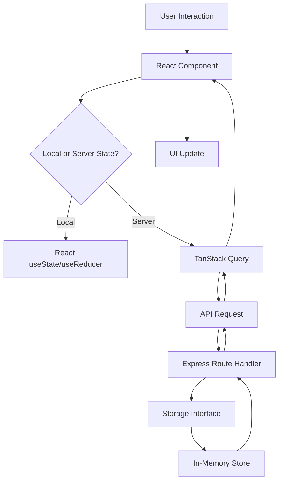

# Arquitectura Técnica - Telefire México

## 🏗️ Vista General del Sistema

Telefire México está construido como una **Single Page Application (SPA)** con arquitectura **Full-Stack TypeScript**, optimizada para performance, SEO y experiencia de usuario.

```
┌─────────────────┐    ┌─────────────────┐    ┌─────────────────┐
│    Frontend     │    │    Backend      │    │   Storage       │
│   React + TS    │◄──►│  Express + TS   │◄──►│   In-Memory     │
│   Tailwind CSS  │    │   REST API      │    │   (Extensible)  │
└─────────────────┘    └─────────────────┘    └─────────────────┘
```

---

## 🎯 Decisiones Arquitectónicas

### Single Page Application (SPA)
**Decisión**: Implementar como SPA con navegación por anclajes (#hash)

**Razones**:
- Replicar exactamente el comportamiento del sitio original Telefire
- Smooth scrolling entre secciones 
- Estado persistente del carrito
- Mejor performance al evitar recargas
- SEO optimizado con meta tags dinámicos

### Full-Stack TypeScript
**Decisión**: TypeScript en frontend y backend

**Beneficios**:
- Type safety end-to-end
- Interfaces compartidas entre cliente/servidor
- Mejor developer experience
- Detección temprana de errores
- Refactoring seguro

---

## 📋 Stack Tecnológico Detallado

### Frontend Core
```typescript
{
  "framework": "React 18",
  "language": "TypeScript 5.x",
  "routing": "Wouter (client-side)",
  "styling": "Tailwind CSS + shadcn/ui",
  "state": "TanStack Query + React State",
  "forms": "React Hook Form + Zod",
  "build": "Vite"
}
```

### Backend Core
```typescript
{
  "runtime": "Node.js 18+",
  "framework": "Express.js",
  "language": "TypeScript",
  "api": "RESTful under /api prefix",
  "validation": "Zod schemas",
  "storage": "In-memory with IStorage interface"
}
```

### Herramientas de Desarrollo
```typescript
{
  "bundler": "Vite",
  "typeChecker": "TypeScript compiler",
  "linting": "ESLint (configurado para React/TS)",
  "formatting": "Prettier",
  "deployment": "Netlify with auto-deploy"
}
```

---

## 📁 Estructura de Directorios

### Organización del Proyecto
```
telefire-mexico/
├── client/                    # Frontend React
│   ├── src/
│   │   ├── components/        # Componentes reutilizables
│   │   │   ├── ui/           # shadcn/ui primitivos
│   │   │   ├── navigation/   # Header, Footer, Navbar
│   │   │   └── sections/     # Secciones de página
│   │   ├── pages/            # Páginas de la aplicación
│   │   ├── hooks/            # Custom React hooks
│   │   ├── lib/              # Utilidades y configuración
│   │   ├── App.tsx           # Componente raíz
│   │   ├── main.tsx          # Entry point
│   │   └── index.css         # Estilos globales
│   └── index.html            # Template HTML
├── server/                   # Backend Express
│   ├── index.ts              # Servidor principal
│   ├── routes.ts             # Definición de rutas API
│   ├── storage.ts            # Interfaz de almacenamiento
│   └── vite.ts               # Integración Vite
├── shared/                   # Código compartido
│   └── schema.ts             # Esquemas Zod y tipos TS
├── attached_assets/          # Assets del usuario
├── docs/                     # Documentación técnica
├── package.json              # Dependencias y scripts
├── vite.config.ts            # Configuración Vite
├── tailwind.config.ts        # Configuración Tailwind
├── tsconfig.json             # Configuración TypeScript
├── netlify.toml              # Configuración deployment
└── README.md                 # Documentación principal
```

### Convenciones de Naming
```typescript
// Componentes: PascalCase
export default function ProductCard() {}

// Hooks: camelCase con 'use' prefix
export function useCartCounter() {}

// Utilidades: camelCase
export function scrollToSection(id: string) {}

// Constantes: SCREAMING_SNAKE_CASE
export const API_ENDPOINTS = {}

// Interfaces: PascalCase con 'I' prefix opcional
export interface Product {}
export interface IStorage {}
```

---

## 🔄 Flujo de Datos

### Arquitectura de Estado


### Gestión de Estado por Capas

#### 1. UI State (Local)
```typescript
// React state para UI interactions
const [isMenuOpen, setIsMenuOpen] = useState(false)
const [activeCategory, setActiveCategory] = useState("all")
const [cartItems, setCartItems] = useState<string[]>([])
```

#### 2. Server State (TanStack Query)
```typescript
// Server state con cache y sincronización
const { data: products, isLoading } = useQuery({
  queryKey: ['/api/products'],
  staleTime: 5 * 60 * 1000, // 5 minutes
})

const mutation = useMutation({
  mutationFn: (data) => apiRequest('/api/contact', 'POST', data),
  onSuccess: () => {
    queryClient.invalidateQueries(['/api/contacts'])
  }
})
```

#### 3. Global State (Context when needed)
```typescript
// Para estado compartido entre componentes distantes
const CartContext = createContext<CartContextType>()
```

---

## 🔌 Integración Frontend-Backend

### API Design Pattern
```typescript
// Consistent API structure
interface ApiResponse<T> {
  success: boolean
  data?: T
  error?: string
  timestamp: string
}

// Routes follow RESTful conventions
GET    /api/products          # Listar productos
POST   /api/products          # Crear producto
GET    /api/products/:id      # Obtener producto
PUT    /api/products/:id      # Actualizar producto
DELETE /api/products/:id      # Eliminar producto

POST   /api/contact           # Enviar formulario
GET    /api/health            # Health check
```

### Validation Pipeline
```typescript
// 1. Client-side validation (React Hook Form + Zod)
const formSchema = contactFormSchema.extend({
  additionalField: z.string().optional()
})

// 2. Server-side validation (Express + Zod)
app.post('/api/contact', (req, res) => {
  const result = contactFormSchema.safeParse(req.body)
  if (!result.success) {
    return res.status(400).json({ 
      error: 'Validation failed',
      details: result.error.errors 
    })
  }
  // Process valid data...
})
```

---

## 🎨 Sistema de Design

### Atomic Design Methodology
```
📦 Components
├── 🔬 Atoms (ui/)
│   ├── Button
│   ├── Input
│   ├── Badge
│   └── Avatar
├── 🧬 Molecules (combinations)
│   ├── SearchBox
│   ├── ProductCard
│   └── ContactForm
├── 🏗️ Organisms (sections/)
│   ├── Navbar
│   ├── ProductCatalog
│   └── Footer
└── 📄 Templates (pages/)
    ├── Home
    └── NotFound
```

### Theming System
```css
/* CSS Custom Properties for consistency */
:root {
  --color-telefire-red: #DC2626;
  --color-telefire-blue: #1E40AF;
  --color-telefire-gray: #6B7280;
  
  --font-primary: 'Inter', sans-serif;
  --font-heading: 'Poppins', sans-serif;
  
  --spacing-xs: 0.25rem;
  --spacing-sm: 0.5rem;
  --spacing-md: 1rem;
  --spacing-lg: 1.5rem;
  --spacing-xl: 2rem;
}
```

### Responsive Design Strategy
```css
/* Mobile-first approach */
.component {
  /* Mobile styles (default) */
  padding: var(--spacing-sm);
}

@media (min-width: 768px) {
  .component {
    /* Tablet styles */
    padding: var(--spacing-md);
  }
}

@media (min-width: 1024px) {
  .component {
    /* Desktop styles */
    padding: var(--spacing-lg);
  }
}
```

---

## 🚀 Performance Architecture

### Code Splitting Strategy
```typescript
// Route-based code splitting
const HomePage = lazy(() => import('./pages/Home'))
const ProductsPage = lazy(() => import('./pages/Products'))

// Component-based splitting for heavy components
const ChartComponent = lazy(() => import('./components/Chart'))
```

### Asset Optimization
```typescript
// vite.config.ts optimization
export default defineConfig({
  build: {
    rollupOptions: {
      output: {
        manualChunks: {
          // Vendor chunk for stable libraries
          vendor: ['react', 'react-dom', 'react-router-dom'],
          
          // UI chunk for component library
          ui: ['@radix-ui/react-dialog', '@radix-ui/react-dropdown-menu'],
          
          // Utils chunk for utilities
          utils: ['clsx', 'date-fns', 'zod']
        }
      }
    },
    
    // Asset optimization
    assetsInlineLimit: 4096, // < 4kb assets inlined as base64
    chunkSizeWarningLimit: 1000,
  }
})
```

### Caching Strategy
```typescript
// TanStack Query cache configuration
const queryClient = new QueryClient({
  defaultOptions: {
    queries: {
      // Data considered fresh for 5 minutes
      staleTime: 5 * 60 * 1000,
      
      // Cache data for 10 minutes
      cacheTime: 10 * 60 * 1000,
      
      // Retry failed requests
      retry: 2,
      
      // Refetch on window focus (disabled for better UX)
      refetchOnWindowFocus: false,
    }
  }
})
```

---

## 🔒 Security Architecture

### Client-Side Security
```typescript
// Input sanitization
import DOMPurify from 'dompurify'

const sanitizeInput = (input: string) => {
  return DOMPurify.sanitize(input, {
    ALLOWED_TAGS: [], // No HTML tags allowed
    ALLOWED_ATTR: []
  })
}

// XSS prevention in dynamic content
const SafeHtml = ({ content }: { content: string }) => (
  <div dangerouslySetInnerHTML={{ 
    __html: DOMPurify.sanitize(content) 
  }} />
)
```

### Server-Side Security
```typescript
// Input validation
app.use(express.json({ limit: '10mb' }))
app.use(helmet()) // Security headers

// Rate limiting
const limiter = rateLimit({
  windowMs: 15 * 60 * 1000, // 15 minutes
  max: 100 // limit each IP to 100 requests per windowMs
})
app.use('/api', limiter)

// CORS configuration
app.use(cors({
  origin: process.env.NODE_ENV === 'production' 
    ? ['https://telefire.com.mx']
    : ['http://localhost:3000']
}))
```

---

## 📊 Monitoring and Analytics

### Error Tracking
```typescript
// Error boundary implementation
class ErrorBoundary extends Component {
  state = { hasError: false, error: null }

  static getDerivedStateFromError(error: Error) {
    return { hasError: true, error }
  }

  componentDidCatch(error: Error, errorInfo: ErrorInfo) {
    // Log to monitoring service
    console.error('Error Boundary:', error, errorInfo)
    
    // Send to Sentry/LogRocket if configured
    if (window.Sentry) {
      window.Sentry.captureException(error)
    }
  }

  render() {
    if (this.state.hasError) {
      return <ErrorFallback error={this.state.error} />
    }
    return this.props.children
  }
}
```

### Performance Monitoring
```typescript
// Core Web Vitals tracking
import { getCLS, getFID, getFCP, getLCP, getTTFB } from 'web-vitals'

// Send to analytics
const sendToAnalytics = (metric: Metric) => {
  if (window.gtag) {
    window.gtag('event', metric.name, {
      event_category: 'Web Vitals',
      event_label: metric.id,
      value: Math.round(metric.value),
      non_interaction: true,
    })
  }
}

// Track all metrics
getCLS(sendToAnalytics)
getFID(sendToAnalytics)
getFCP(sendToAnalytics)
getLCP(sendToAnalytics)
getTTFB(sendToAnalytics)
```

---

## 🔄 Extensibilidad y Futuras Mejoras

### Database Integration Ready
```typescript
// Current: In-memory storage interface
interface IStorage {
  getProducts(): Promise<Product[]>
  createContact(data: ContactForm): Promise<void>
}

// Future: Database implementation
class PostgreSQLStorage implements IStorage {
  async getProducts(): Promise<Product[]> {
    return await db.select().from(products)
  }
  
  async createContact(data: ContactForm): Promise<void> {
    await db.insert(contacts).values(data)
  }
}
```

### CMS Integration Points
```typescript
// Headless CMS adapter pattern
interface ICMSAdapter {
  getProducts(): Promise<Product[]>
  getTestimonials(): Promise<Testimonial[]>
  getCaseStudies(): Promise<CaseStudy[]>
}

// Strapi implementation
class StrapiAdapter implements ICMSAdapter {
  async getProducts(): Promise<Product[]> {
    const response = await fetch(`${STRAPI_URL}/api/products`)
    return response.json()
  }
}

// Contentful implementation
class ContentfulAdapter implements ICMSAdapter {
  // Implementation...
}
```

### Internationalization Ready
```typescript
// i18n structure preparation
const translations = {
  es: {
    nav: {
      products: "Productos",
      solutions: "Soluciones",
      contact: "Contacto"
    },
    products: {
      panels: "Paneles de Control",
      detectors: "Detectores"
    }
  },
  en: {
    nav: {
      products: "Products",
      solutions: "Solutions", 
      contact: "Contact"
    }
  }
}
```

---

## 📈 Scalability Considerations

### Horizontal Scaling
- **CDN**: Assets served through Netlify Edge
- **API Scaling**: Serverless functions auto-scale
- **Database**: Ready for PostgreSQL with connection pooling
- **Caching**: Redis integration ready for session/query cache

### Vertical Optimization
- **Bundle Size**: Optimized with tree-shaking and code splitting
- **Memory Usage**: Efficient React patterns and cleanup
- **Network**: Request batching and deduplication
- **Rendering**: Virtual scrolling for large lists

### Migration Paths
1. **Database**: Memory → PostgreSQL → Distributed DB
2. **Auth**: None → JWT → OAuth2 → SSO
3. **CMS**: Static → Headless → Multi-tenant
4. **Deployment**: Netlify → Multi-region → Edge computing

---

**Esta arquitectura está diseñada para crecer con las necesidades del negocio, manteniendo la simplicidad inicial mientras permite expansiones sofisticadas.** 🏗️